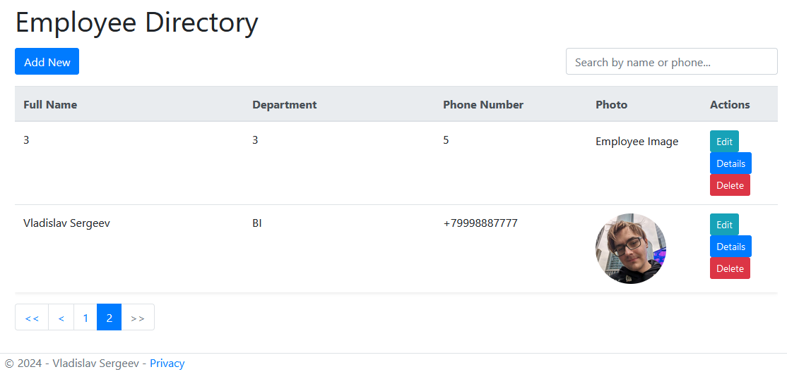
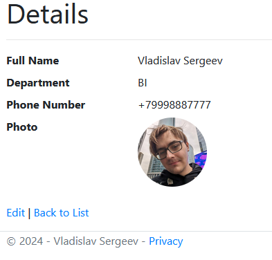
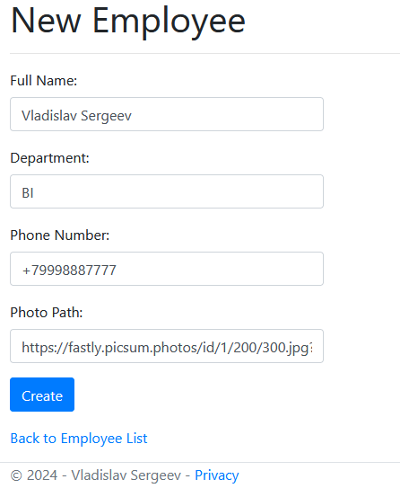
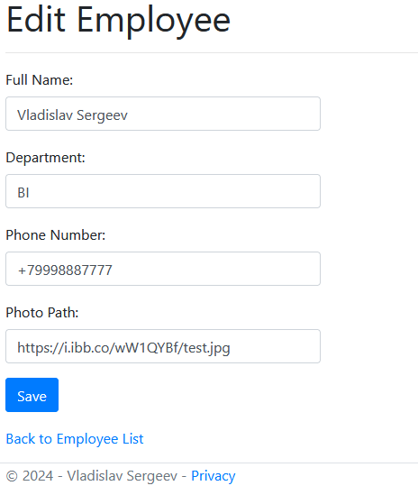
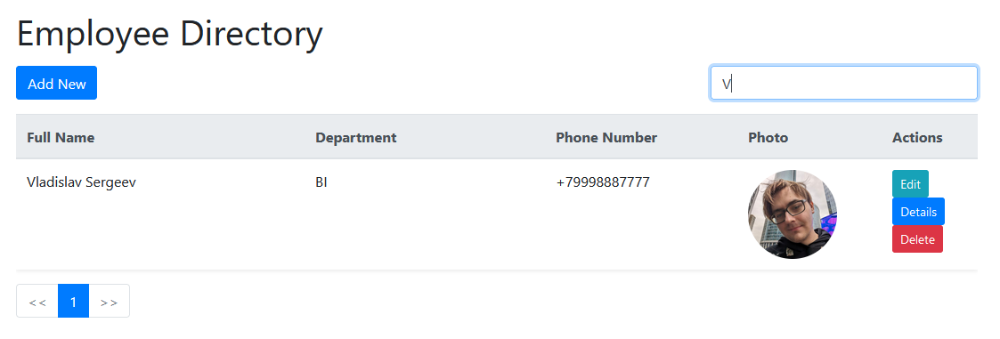

### Home Page

Here you can see the home page where all employees are listed with options to edit, delete, or add new ones.

### Employee Details

This screenshot shows the details view for an employee.

### Create Employee

This page is used to add a new employee to the directory.

### Edit Employee

Here you can see the edit view where you can update an employee's details.

### Delete Employee

This screenshot shows the delete confirmation dialog for an employee.

### Search Functionality

Here is how the search functionality works, filtering the employees displayed based on the search term.

